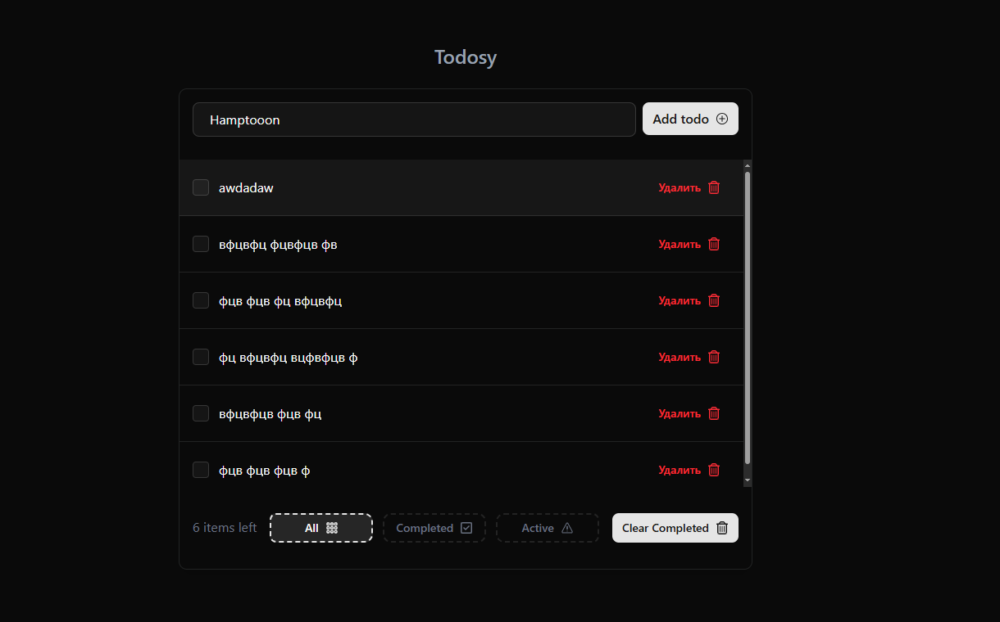

# 🚀 Todo App Intern — Управление задачами тестовое задание для стажировки

## **[Демо (Github Pages)](https://hamptooon.github.io/todos-intern-task/)**

https://hamptooon.github.io/todos-intern-task/


## 🌟 Особенности

### 🧩 Функционал

- **Добавление задач** с валидацией (1-65 символов)
- **3 фильтра просмотра**: Все/Активные/Завершенные
- **Динамическая статистика**: Число активных задач
- **Массовая очистка** завершенных задач
- **Темная/светлая тема** с сохранением в localStorage
- **Адаптивный дизайн** для всех устройств
- **Кастомный скроллбар** с анимациями
- **Интуитивный UI** с мгновенной обратной связью

### 🛠 Технологический стек

| Технология          | Назначение                  |
| ------------------- | --------------------------- |
| **React 18**        | Базовый фреймворк           |
| **TypeScript**      | Статическая типизация       |
| **Redux Toolkit**   | Управление состоянием       |
| **Tailwind CSS**    | Стилизация + кастомные темы |
| **shadcn/ui**       | Доступные UI-компоненты     |
| **Zod**             | Валидация форм              |
| **React Hook Form** | Управление формами          |
| **Vite**            | Сборка + Dev Server         |

## 🏗 Архитектура (FSD)

```
src/
├── app/            # Инициализация приложения провайдеры
├── pages/          # Страницы приложения
├── widgets/        # Композиция фич/сущностей
├── features/       # Бизнес-фичи (добавление, фильтры и т.д)
├── entities/       # Бизнес-сущности (задача)
├── shared/         # Переиспользуемые ресурсы
```

## 🚀 Запуск проекта

### Требования

- Node.js ≥18.0
- npm ≥9.0

### Установка

```bash
git clone https://github.com/hamptooon/todos-intern-task.git
cd todos-intern-task
npm install
```

### Команды

```bash
# Запуск dev-сервера
npm run start

# Сборка для production
npm run build

# Деплой на GitHub Pages
npm run deploy

# Запуск тестов (Jest + Testing Library)
npm run test
```

## 🎨 Дизайн-система

- **Цвета**: Кастомные OKLCH-палитры
- **Анимации**: Нативные переходы Tailwind
- **Типографика**: Системные шрифты (оптимизация загрузки)
- **Темы**: Глубокие кастомные CSS-переменные

## 🤔 Почему именно этот стек?

1. **TypeScript** — предотвращение ошибок на этапе разработки
2. **Redux Toolkit** — предсказуемое управление состоянием
3. **Tailwind + shadcn** — скорость разработки без потери кастомизации
4. **Zod** — типобезопасная валидация с человекочитаемыми ошибками
5. **FSD** — масштабируемость и четкое разделение ответственности

## 📜 Лицензия

MIT License — [Подробнее](LICENSE)
